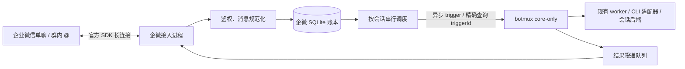

# botmux 企业微信接入方案

- 日期：2026-09-20
- 状态：已实现并完成本机部署验收
- 代码基线：`787df835`
- 开发分支：`codex/wecom-support`

## 目标与已确认需求

让企业微信内部成员通过单聊或群内 @智能机器人，驱动 botmux 管理的 AI 编程 CLI，持续追问并收到任务结果。

用户已确认：**同一个群的成员共享一个 CLI 会话和上下文**。群内输入按持久化接收顺序串行执行。不同群相互独立；单聊按发送者隔离。上下文隔离不等于文件系统隔离，同一工作目录的文件仍可能被不同会话访问。

第一版提供文本任务闭环、结果回传、会话续接、访问控制、重复消息抑制及接入层重启恢复。不把消息回显 Demo 当成 CLI 集成完成。

## 调研依据

- 已读取引用任务《调研企微 Agent 集成方案》。该任务记录官方 Python SDK 已完成真实群消息接收、回显及主动推送；它验证的是通道，未接入 botmux。
- botmux 是 TypeScript/Bun 项目，采用 [官方 Node SDK](https://github.com/WecomTeam/aibot-node-sdk)。本次核对到 `WSClient`、`replyStream`、`sendMessage` 及消息事件接口；实施时核对 npm 发布版本为 1.0.7，已锁定该版本。
- 企业微信端沿用“智能机器人 → API 模式 → 使用长连接”，使用 `WECOM_BOT_ID` 和 `WECOM_BOT_SECRET`，配置说明参考 [官方长连接文档](https://developer.work.weixin.qq.com/document/path/101463)。本次文档站抓取失败；10 分钟流窗口、会话限流及连接互斥规则来自引用任务的此前调研，实施时需复核，不能视为本次重新验证。
- 用户已授权部署实测，沿用本机受保护的 Demo 凭证；切换前已停止原 Demo 进程，避免同一机器人多连接竞争。本分支不包含真实凭证。

## 方案选择

| 方案 | 优点 | 代价与适用范围 |
| --- | --- | --- |
| **TypeScript 企微接入层 + 现有 core-only 执行服务（推荐）** | 复用 CLI、队列、异步结果和恢复机制；已有明确的无飞书边界 | 首版使用状态提示和最终回答；飞书卡片、交互授权尚不能直接复用 |
| 抽象完整通用 IM 层并迁移飞书 | 有利于长期统一卡片、会话控制和多平台配置 | 涉及 daemon、worker-pool、身份、Bot 注册及 UI；回归面远超单一适配器 |
| Python SDK 外置服务 | 能复用原验证 Demo | 增加 Python 运行时与双语言部署，不符合 botmux 当前单文件发布形态 |

选择第一条作为本阶段设计。未来原生多 IM 改造可替换执行接口，企微消息规范化、会话路由和投递账本可继续使用。

## 架构及现有复用点



现有接口已从源码核对：

- `src/index-core-only.ts`：独立状态目录、loopback 监听、无飞书凭证、恢复完成后才 ready。
- `src/services/trigger-types.ts`：`asyncReturnSessionId`，首轮 `idempotencyKey`，续轮 `turnIdempotencyKey`。
- `src/core/dashboard-ipc-server.ts`：`POST /api/trigger`、`GET /api/sessions/:id/trigger-result?triggerId=...`；结果有 running/completed/failed/not_found 四种状态。
- `src/services/async-trigger-store.ts`：最终结果持久化与重启后查询。
- `src/core/types.ts`：`larkTransportEnabled` 禁止 apiOnly / HTTP 虚拟会话触达飞书。
- `src/services/sqlite-compat.ts`、`src/core/self-spawn.ts`：复用 SQLite 引擎兼容及源码/编译态子进程启动机制。

接入进程通过已有 HTTP 合约驱动执行服务，不直接访问 DaemonSession 内存结构。企微 bot ID 与内部合成的 `local_wecom_<slug>` 身份分开；后者只是现有 core-only 的路由标识，不是飞书应用。

## 会话与共享群行为

会话键包含机器人和会话种类，使用结构化序列化后哈希生成存储键，避免拼接歧义和路径注入：

- 单聊：`[wecomBotId, single, senderUserId]`。
- 群聊：`[wecomBotId, group, chatId]`，**不包含发送者**。

群里只有平台实际投递给机器人的消息进入队列，不承诺读取全部群聊天或历史记录。

每次输入保存真实发送者来源信息，但它不成为系统指令或飞书 owner。群里甲的消息运行时，乙的消息排队；甲完成后乙续接同一 sessionId。不同群可并行，受全局并发限制。

首版提供 `/help`、`/status`、`/new` 三个确定性命令。`/new` 仅管理员可用：当前群无运行和排队任务时开启新会话代次；忙时明确拒绝，避免悄悄丢弃队列。旧记录仍可审计。暂停、终止、原生 CLI 授权交互需要受会话约束的控制接口，不扩开现有无鉴权 IPC 路由来实现。

## 接收、执行与重启恢复

账本使用独立 SQLite 文件，至少包含会话映射、入站消息、执行绑定、出站分片。入站唯一键为 `(botId, msgid)`，队列以数据库序号排序。

1. 校验回调结构、机器人身份和发送权限，限制输入大小；不支持的媒体类型给出文本提示。
2. 原子保存消息及不可变路由快照，再发“已接收/已排队”。消息内容、发送者和目标会话不能由模型输出改写。
3. 会话锁内取得队首。首次调用使用稳定的 `idempotencyKey`；已存在 sessionId 时使用 `turnIdempotencyKey`。键从机器人和原始消息唯一键计算，不能在重试时重新生成。
4. HTTP 提交超时后，必须以相同请求和同一幂等键重试。不能因没有收到响应改为新建 CLI 会话。
5. 保存 sessionId、triggerId 后，只查询这一条 triggerId 的结果，防止多人共享时把上一轮结果当成当前答案。
6. 最终输出先持久化，再进入企微发送队列；执行完成与投递完成是两个状态。
7. 接入层重启时恢复未决提交、结果查询及待发送分片。core-only 恢复期间遇到 503 退避等待；对 failed/not_found 或 dispatch_unknown 停止自动重跑原任务并说明状态。

恢复保证只覆盖本地成功保存的消息；SDK 自动重连不证明平台会补发断线期间的消息。发送回执丢失可能造成未知投递结果，不能宣称端到端 exactly-once。

## 回复策略

- SDK 流式消息用于简短的接收/排队确认，立即 `finish=true`。第一版不承诺逐 token 流式输出。
- 完成后用 `sendMessage` 回到原单聊或原群。长任务不依赖一直保持打开的流式回复。
- 共享群的结果附短任务编号和请求者标记，避免多人结果难以对应；失败原因使用适合群内展示的脱敏信息。
- 按 UTF-8 字节分片；预留编号和格式开销，超长代码块按文本分片保留内容。不静默截断最终结果。
- 按企微真实会话限流，不按 CLI 会话单独限流。进度提示合并，最终结果优先。协议配额需实施时复核。
- 有明确拒绝回执的限流/临时失败可退避重试；发送超时但可能已成功时记为 `delivery_unknown`，不无界重发。`/status` 展示执行与投递各自状态。
- 原始命令、终端截图、内部 URL、读写 token、完整日志不自动发到群里。

## 权限与凭证

- 默认拒绝未配置的发送者。`allowedUsers` 控制谁可提交任务；群聊同时检查 `allowedChats`。`adminUsers` 控制 `/new` 等管理动作。
- allowlist 使用已认证企微回调中的 userid/chatid，不按昵称匹配，不把飞书 `ou_`/`on_` 复制为企微身份。
- 群内共享意味着获准成员可以通过该群的同一 CLI 上下文协作；不是每人一套系统权限或文件沙盒。
- 企微发送者作为不可信事件数据传入 trigger envelope；固定执行指令由部署配置控制。不得把消息文本映射到 trusted caller、botmux owner 或权限提升字段。
- CLI 子进程不继承企微 Secret，继续使用 `applySessionOwnerEnv` 的原有边界；没有飞书 owner 的 core-only 会话不伪造 owner。
- core-only 的控制 API 是同机信任接口，不向局域网/公网暴露。不新增免 HMAC 的管理路由。
- 接入凭证与执行进程环境分开。配置文件权限 0600，不提交真实配置；日志及 SDK logger 不输出认证帧或 Secret。文件权限本身不隔离同一 OS 用户，CLI 的读写范围仍由部署时的 sandbox 决定。
- 同机器人同机只允许一个连接所有者；进程锁与机器人身份绑定。被平台踢下线时停止竞争并报错，不由多个实例无限互踢。跨主机多活不在本阶段范围内。

## 配置与启动入口

已新增 `botmux wecom serve --config <path>` 和 `botmux wecom check-config --config <path>`。完整用法见 [部署说明](../wecom.md)。

配置包含：独立状态目录、core-only 端口和本地标识、固定 workingDir/cliId、`allowedUsers`、`allowedChats`、`adminUsers`、并发及队列上限。凭证使用 `WECOM_BOT_ID`、`WECOM_BOT_SECRET` 环境变量或显式加载的受保护 env 文件。配置检查不联网，不以“格式通过”宣称凭证有效。

`serve` 管理企微连接和专用 core-only 子进程：端口占用应失败，不擅自连接未知服务；等待 core-only ready 后才接收工作；SIGINT/SIGTERM 停止入站、持久化状态、关闭连接并等待子进程退出。通过 `resolveEntrySpawn` 增加必要入口，兼容单文件二进制。

原 Demo 与新服务不能使用同一机器人同时运行。部署测试已停止原 Demo 后再启动新服务。

## 文件范围与依赖管理

新增：

- `src/im/wecom/`：配置校验、SDK transport、消息解析、访问控制、共享会话路由、SQLite 账本、core-only client、出站队列和生命周期。
- `src/cli/wecom-command.ts` 与 `src/index-wecom.ts`：可验证配置及正式运行入口。
- `test/wecom-*.test.ts`：行为测试；真实 SDK 连接本地模拟 WSS/HTTP 服务，不使用线上凭证。
- `docs/wecom.md` 与无凭证配置示例：企业微信配置、部署、运维、能力边界和验收步骤。

有限修改：`src/cli.ts` 命令路由、`src/core/self-spawn.ts` 入口映射、构建 smoke、`package.json`/`bun.lock` 增加官方 SDK，以及 README 能力入口。未改变飞书路由或 BotConfig。实际部署发现 Codex App 返回纯静默标记时，异步结果未收敛；补充其签名完成消息的明确静默证据及持久化处理，回归覆盖普通输出、已发送抑制及被合并轮次。

本 worktree 已采用独立 node_modules：在 worktree 之外的临时安装目录准备 package.json/lock，安装并验证后迁入，没有在 worktree 运行 install 或穿透共享 symlink 写入。保留 trustedDependencies 原有两项，不修改 version。

## 验证和验收

| 范围 | 必须验证的行为 |
| --- | --- |
| 收发 | 文本单聊、群内 @、不支持类型、UTF-8 分片、明确错误与未知投递结果 |
| 共享群 | 两名发送者同群使用同一 sessionId；串行且结果归属正确；跨群和跨 bot 隔离 |
| 幂等与恢复 | 重复回调、提交响应丢失、重启后继续查同一 triggerId、completed/failed/not_found、出站待发送恢复 |
| 权限 | 未授权用户/群拒绝、普通成员不能 /new、恶意路由字段及 owner 注入无效、Secret 不传给 worker |
| 连接 | 认证失败、重连、重复实例拒绝、被顶替停机、优雅关闭、core-only 503 与端口冲突 |
| 跨平台 | macOS 与 Linux 的路径、信号、锁、SQLite；Bun 1.4.2 与受支持 Node；子进程测试使用 ts-runner helper |
| CLI/后端 | 首选 CLI 与至少一个不同 CLI；PTY/tmux 可用路径；不把共享执行引擎等同全部 CLI 已实测 |
| 飞书回归 | apiOnly 及 Lark transport 边界、普通飞书话题/群会话、restore/adopt、sandbox on/off 的受影响路径 |
| 编译态 | 构建后实际启动企微入口及 core-only 路径；不能只依赖空 bots.json smoke |

功能完成后的仓库检查包括 `bun run build`、相关单测、编译态 smoke。需要人工验证时按仓库要求执行部署/重启并查看子进程日志，不能只依据 restart 命令打印成功。实测应记录接收、CLI 执行、企微回执三个阶段。不得在未经验证时写“企业微信已支持”或“所有 CLI 均兼容”。

## 当前已执行验证

- Worktree 与新分支已创建；原 checkout 仍在 `learn`，无未提交修改。
- 本机 Bun 1.4.2、Node v22.23.2。
- 执行命令：

```bash
bun run test -- test/headless-command.test.ts test/api-only-mode-wiring.test.ts test/api-only-transport-boundary.test.ts test/lark-transport-boundary.test.ts test/trigger-session-idempotency.test.ts test/trigger-session-turn-idempotency.test.ts
```

- 结果：6 个测试文件、116 项测试通过。这些是现有基线测试，不是新增企微实现的测试。
- `bun run build` 通过，包括 TypeScript、脚本/测试 mock 类型检查、Dashboard 打包和构建资产审计。
- 新增企微配置、消息、队列、HTTP client、官方 SDK 协议及进程生命周期测试共 28 项通过。
- 已建立真实企微连接，部署验收与后续回归结果见 [验收记录](../wecom-validation.md)。
